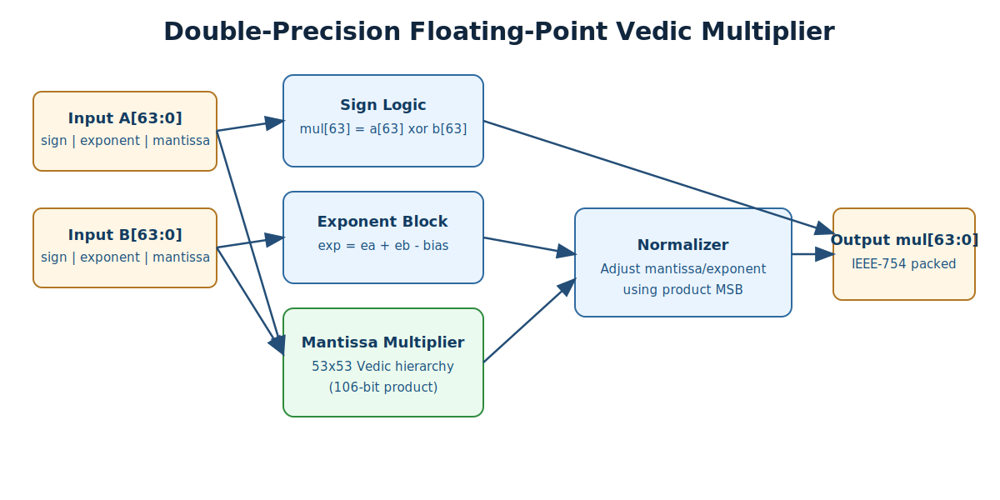

# High-Speed Double-Precision Floating-Point Vedic Multiplier

[](LICENSE)
[](#)
[](.github/workflows/icarus-ci.yml)
[](.github/workflows/repo-hygiene.yml)

A user-ready Verilog RTL implementation of a 64-bit floating-point multiplier that uses a hierarchical Vedic multiplier for mantissa multiplication.

## What This Repository Is For

Use this repository if you want to:

- Study a modular floating-point multiplier datapath in Verilog.
- Simulate the design in both Icarus Verilog and Vivado xsim.
- Reuse or extend the Vedic-based mantissa multiplier hierarchy.

## Architecture Summary

The design processes two 64-bit operands through four paths:

- Sign path: `mul[63] = a[63] ^ b[63]`
- Exponent path: exponent addition with IEEE-754 bias subtraction
- Mantissa path: 53x53 Vedic multiplier hierarchy (with implicit leading `1`)
- Normalization path: mantissa/exponent adjustment from product MSB



## Functional Scope

Current RTL behavior is targeted at normalized finite operands.

Not currently implemented:

- NaN handling
- Infinity handling
- Subnormal/denormal handling
- IEEE-754 rounding modes beyond the current logic

## Quick Start

### Icarus Verilog

Linux/macOS:

```bash
make run
```

Windows CMD:

```bat
run_icarus.bat
```

Windows PowerShell:

```powershell
powershell -ExecutionPolicy Bypass -File .\run_icarus.ps1
```

Expected summary:

```text
PASS: all directed floating-point vectors matched.
```

Waveform file: `wave.vcd`

### Vivado (xsim)

Windows CMD:

```bat
run_vivado.bat
```

Windows PowerShell:

```powershell
powershell -ExecutionPolicy Bypass -File .\run_vivado.ps1
```

Vivado flow steps:

1. Compile RTL from `rtl_sources.f`
2. Compile testbench `tb/tb_double_precision.v`
3. Elaborate `tb_double_precision`
4. Run simulation to completion

## Verification Approach

`tb/tb_double_precision.v` is a self-checking directed testbench using known IEEE-754 hex vectors, including:

- Positive normalized values
- Fractional values
- Sign-combination checks (negative x positive, negative x negative)

## Project Structure

- `double_precision.v`: top-level DUT
- `exponent.v`, `normalizer.v`: exponent/normalization stages
- `vedic_*.v`: hierarchical Vedic multiplier blocks
- `adder*.v`, `mux*.v`, `*_gate.v`: arithmetic and gate primitives
- `tb/tb_double_precision.v`: verification testbench
- `rtl_sources.f`: simulation compile order
- `scripts/run_vivado.tcl`: Vivado batch script
- `run_icarus.*`, `run_vivado.*`: user runner scripts
- `docs/legal/PATENT_NOTICE.md`: patent and IP notice
- `Patent.pdf`: patent reference document in this repo

## Community and Process

- [Contributing Guide](CONTRIBUTING.md)
- [Code of Conduct](CODE_OF_CONDUCT.md)
- [Security Policy](SECURITY.md)
- [Citation Metadata](CITATION.cff)
- [Reproducibility Guide](docs/REPRODUCIBILITY.md)
- [Benchmark Plan](docs/BENCHMARK_PLAN.md)

## Patent and Usage Notice

Part of this design is associated with a patented (or patent-pending) Prime Bit Vedic Multiplier concept.

- Patent reference: [`Patent.pdf`](Patent.pdf)
- India application: `202341051131 A`
- Filed: `29/07/2023`
- Published: `01/09/2023`

Read [Patent Notice](docs/legal/PATENT_NOTICE.md) before commercial use.

## License

Code is available under the [MIT License](LICENSE).

Patent rights are separate from copyright licensing.
